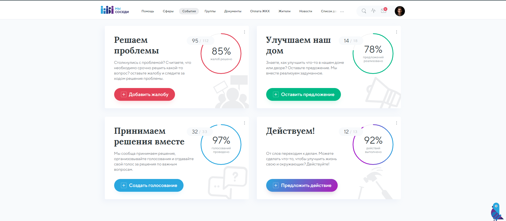

##Demo
Demo url: [http://dmtk.space/sevensuns/](http://dmtk.space/sevensuns/)



## ТЗ

* поддерживаемые браузеры:
  * последние 2 версии
  * IE 11+

* разрешения
  * минимальное разрешение 1200

* стек:
  * pug для сборки html
  * scss - препроцессор css
  * БЭМ в качестве методологии именования классов
  * ES6 в js, транспайлим бабелем

## Страницы с примерами

Список страниц: http://localhost:3000/pages.html

UI KIT: http://localhost:3000/ui-kit.html

### Структура проекта


### Разработка
``` bash
# Установка зависимостей
$ npm i

# Запуск dev-сервера
$ npm run dev

# Запуск прод-сборки
$ npm run build
```


